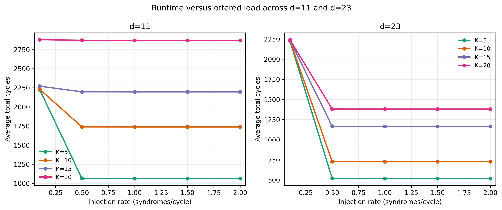
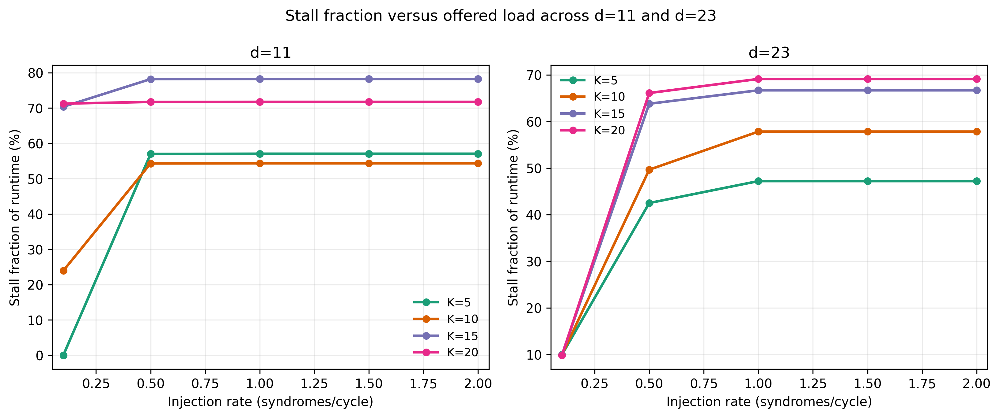
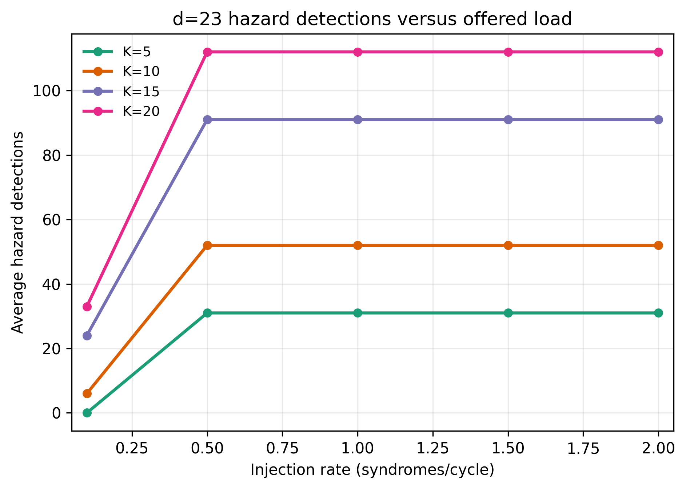

# QueueBit: A Hardware Dispatcher for Online Syndrome Routing in Surface-Code Decoding

## Abstract

Real-time quantum error correction requires classical control logic that can route syndrome events to processing units without creating unsafe overlap between concurrently active work regions. This report presents QueueBit, a hardware dispatcher for online syndrome routing in surface-code decoding pipelines. QueueBit is not a full decoder. It is a control-plane component that receives syndrome coordinates, checks them against the active lock state, and either issues them to a worker or stalls until the hazard clears. The design is evaluated at two operating points, d=11 and d=23, using worker-latency and offered-load sweeps. The results show that QueueBit behaves predictably across both scales, with clear source-limited and saturated regimes. A naive baseline without hazard checking produces 138 unsafe concurrent pairs out of 439 concurrent pairs, confirming that collision-aware dispatch is functionally necessary. Post-route FPGA implementation on XC7Z020 meets the applied 100 MHz timing target at both d=11 and d=23. The d=23 results also show substantial blocked hazard activity at larger scale and heavier load, which makes d=23 the main platform for discussing operating limits.

## 1. Introduction

Surface-code quantum error correction depends on fast classical processing. Syndrome bits must be collected, interpreted, and routed to decoder logic quickly enough that the correction pipeline does not fall behind the quantum system. Much of the literature focuses on the decoder itself, for example matching-based decoders, Union-Find decoders, and cluster-based methods. However, before a worker or decoder stage can process a syndrome, that syndrome must first be assigned safely.

This report studies that assignment problem. If two workers are allowed to process nearby syndromes at the same time, they may operate on overlapping spatial regions. In a practical decoding pipeline this creates a coordination problem. QueueBit addresses this by placing a hardware dispatch layer in front of the workers. The dispatcher keeps track of active regions, tests whether a new syndrome would conflict with the current lock state, and either issues the syndrome immediately or stalls it until the hazard clears.

The contribution of this work is therefore not a new decoder algorithm. It is a hardware dispatch mechanism for online, collision-aware syndrome routing. The report focuses on three questions:

1. Is active hazard checking actually necessary?
2. How does the dispatcher behave as worker latency and offered load change?
3. Does the design remain implementable when scaled from a smaller d=11 case to a larger d=23 case?

These questions are answered using a naive baseline, d=11 and d=23 sweeps, and post-route FPGA implementation results.

## 2. Background

Practical quantum computers require continuous error correction to protect logical states from physical noise. In surface codes [6], parity checks are measured repeatedly on a 2D lattice. A change in consecutive parity measurements produces a syndrome event [2].

If syndrome events are not processed fast enough, the decoder backlog grows and can halt the correction pipeline [3]. Real-time decoding avoids this by processing events continuously.

Routing events to parallel workers introduces a spatial hazard: nearby syndromes can overlap in active work regions if they are issued at the same time. QueueBit addresses this dispatch-stage hazard.

## 3. Related Work

Recent hardware decoders handle collision avoidance with different architectural choices.

- Barber et al. (2025) [1] use reactive clustering where collision checks occur during cluster growth in the matching flow.
- QUEKUF (2025) [8] uses a centralized controller with internal conflict handling for stateful multi-round processing on toric codes.
- Kasamura et al. (2025) [5] use per-round batching so that sequential processing within each round avoids overlap.
- Helios (2024) [7] presents a distributed Union-Find architecture with many local processing units.

QueueBit targets a different layer. It is a dispatch-plane block for per-syndrome online routing. It enforces spatial separation at issue time and can be placed in front of downstream decoder workers.

## 4. Scope

QueueBit is designed for surface-code workloads in which syndrome events arrive over time and are routed to a centralized worker pool. The assumption is that each active worker occupies a local spatial neighborhood for a fixed number of cycles. During that window, issuing a nearby syndrome is unsafe.

QueueBit does not implement decoding logic by itself. Its role is to ensure that downstream workers receive a spatially safe stream of assignments. All measurements in this report are dispatcher-level measurements.

## 5. Architecture

QueueBit coordinates dispatch through a hardware pipeline:

`Syndrome stream -> Syndrome FIFO -> Dispatch FSM <-> Tracking Matrix -> 4-worker pool`

### 5.1 Syndrome FIFO

The FIFO buffers incoming syndrome coordinates and decouples source timing from dispatch timing. The interface uses a valid/ready protocol. For both operating points, `FIFO_DEPTH = 32`.

### 5.2 Tracking Matrix

The tracking matrix stores active lock regions and performs conflict checks before issue. The lock policy uses a 3x3 Chebyshev neighborhood around each active syndrome.

When a syndrome is issued, the matrix sets the corresponding 3x3 region. When the worker finishes, the matrix clears that same region.

Configured grid sizes are:

- d=11: `GRID_WIDTH = 21`, `GRID_HEIGHT = 23`, `COORD_W = 5`
- d=23: `GRID_WIDTH = 47`, `GRID_HEIGHT = 47`, `COORD_W = 6`

### 5.3 Dispatch FSM

The FSM uses five states:

- `FSM_IDLE`
- `FSM_FETCH`
- `FSM_HAZARD_CHK`
- `FSM_ISSUE`
- `FSM_STALL`

The worker pool size is `NUM_WORKERS = 4`. In `FSM_HAZARD_CHK`, the candidate syndrome is checked against the matrix. If conflict is detected, the FSM stalls. If not, the FSM issues to the first available worker and applies a lock.

Worker processing time is modeled by configurable latency `K`.

## 6. Experimental Method

### 6.1 Testbench Configuration

Two dispatcher operating points are studied:

- d=11 baseline configuration
- d=23 scale-up configuration

For each case, the dispatcher is exercised with a fixed workload of 221 syndrome pairs. Worker latency is swept across:

- `K in {5, 10, 15, 20}`

Offered load is swept across:

- `inj in {0.1, 0.5, 1.0, 1.5, 2.0}` syndromes per cycle

Each configuration is run three times. The runs are deterministic, so the three repeats serve mainly as a consistency check.

### 6.2 Simulation Flow

The final d=11 and d=23 datasets are taken only from the verified simulation flow. Earlier intermediate runs exposed several issues:

- injection-rate parameters were not initially reaching the simulator
- summaries could be printed before the testbench had fully drained
- d11 stimulus logic had to be updated to respect the FIFO protocol cleanly

These issues were fixed before the final datasets used in this report were generated. The final d11 and d23 logs both show complete runs with valid summaries, zero protocol errors in the d11 sweep, and deterministic results across repeated configurations.

### 6.3 Metrics

The report uses the following metrics:

- `total cycles`: total runtime of one simulation
- `syndromes issued`: total number of dispatched syndromes
- `hazard detections`: number of detected conflicts in the d=23 scale-up path
- `stall cycles`: number of cycles in which the dispatcher is stalled
- `stall fraction of runtime`: `stall_cycles / total_cycles * 100`
- `average busy workers`: average number of active workers over the run

Terminology note:

- Testbench and script outputs use the word `collision` for real-time blocked events.
- In this report, those blocked events in `FSM_HAZARD_CHK` are reported as `hazard detections`.
- `unsafe pairs` is a separate post-simulation metric from the naive baseline trace analysis.

One older metric was intentionally not used in this report: `stalled / issued * 100`. That metric mixes cycles and syndromes and can exceed 100% in a way that is difficult to interpret. The present report instead uses stall fraction of runtime, which remains cycle-normalized.

### 6.4 Synthesis Method

Post-route FPGA implementation was performed for:

- `dispatcher_top` (d=11)
- `dispatcher_top_d23` (d=23)

Target device:

- Xilinx XC7Z020-1CLG484

Clock target:

- 100 MHz

The synthesis numbers in this report should be interpreted as internal design implementation results under the current constraint set. The present study does not yet include a fully board-constrained I/O timing model.

## 7. Results

### 7.1 Naive Baseline

The naive dispatcher disables hazard checking and issues work without spatial protection. This baseline tests whether collision-aware dispatch is actually needed.

The result is clear: the naive baseline produces spatial violations, while the standard dispatcher prevents them by stalling when necessary. Collision-aware dispatch is therefore a functional requirement of the control layer rather than a performance optimization.

**Table 1. Naive baseline summary**

| Mode | Concurrent pairs observed | Unsafe pairs | Unsafe-pair rate |
| --- | ---: | ---: | ---: |
| Standard dispatcher | 144 | 0 | 0.0% |
| Naive dispatcher | 439 | 138 | 31.4% |

### 7.2 d=11 and d=23 Sweeps

The d=11 sweep is the baseline characterization case. All 60 runs are valid, complete, and free of FIFO protocol errors. The d=23 sweep is the main scale-up characterization case. All 60 runs are also complete and deterministic.

Both operating points show the same broad structure:

- `inj=0.1` is source-limited
- `inj >= 1.0` is effectively saturated

At low offered load, the source itself limits throughput. At higher offered load, the dispatcher and worker availability become the limiting factors. This is why the same 221-syndrome workload finishes much faster at `inj=1.0` than at `inj=0.1`.

**Figure 1. Runtime versus offered load**



**Figure 2. Stall fraction versus offered load**



**Table 2. Sweep summary using representative low-load and saturated-load points**

| Distance | K | Cycles at inj=0.1 | Cycles at inj=1.0 | Stall fraction at inj=0.1 | Stall fraction at inj=1.0 |
| --- | ---: | ---: | ---: | ---: | ---: |
| d=11 | 5 | 2225 | 1062 | 0.00% | 57.06% |
| d=11 | 10 | 2230 | 1737 | 23.95% | 54.35% |
| d=11 | 15 | 2271 | 2196 | 70.37% | 78.23% |
| d=11 | 20 | 2880 | 2871 | 71.25% | 71.75% |
| d=23 | 5 | 2226 | 519 | 9.93% | 47.21% |
| d=23 | 10 | 2231 | 728 | 9.91% | 57.83% |
| d=23 | 15 | 2236 | 1165 | 9.88% | 66.70% |
| d=23 | 20 | 2241 | 1380 | 9.82% | 69.13% |

The d=11 case is the cleaner baseline. It shows expected saturation behavior, and larger `K` increases runtime and stall pressure. For example, at `inj=1.0`, runtime rises from `1062` cycles at `K=5` to `2871` cycles at `K=20`.

The d=23 case shows the same low-load versus saturated-load structure, but it also exposes much stronger contention. For example, at `K=5`, runtime drops from `2226` cycles at `inj=0.1` to `519` cycles at `inj=1.0`, while at `K=20` it only drops from `2241` to `1380` cycles because long worker occupancy dominates the runtime.

### 7.3 d=23 Hazard Detections

The most important scale-up result is the hazard-detection behavior at d=23. A d=23 "collision detected" event represents a blocked hazard: the candidate issue conflicts with the active lock state, so the FSM stalls instead of issuing unsafe concurrent work.

To make that interpretation explicit, post-simulation trace verification was run on dispatch logs (`LOCK`/`RELEASE` events) for the saturated d=23 cases with `K=20` and `inj in {0.5, 1.0, 1.5, 2.0}`. Across all four cases, the simulation reported `112` hazard detections, while trace verification reported:

- `0` spatial collisions
- `221` lock events and `221` matching release events
- `457` concurrent syndrome pairs, all safe (`unsafe_pairs = 0`)

Within this tested saturated operating band, every detected hazard was intercepted before issue.

These counts measure how often QueueBit detects that a candidate syndrome conflicts with the current lock state and therefore must be stalled.

**Figure 3. d=23 hazard detections versus offered load**



**Table 3. d=23 hazard detections**

| K | Hazard detections at inj=0.1 | Hazard detections at inj>=0.5 |
| --- | ---: | ---: |
| 5 | 0 | 31 |
| 10 | 6 | 52 |
| 15 | 24 | 91 |
| 20 | 33 | 112 |

This result should be interpreted as follows:

1. larger `K` keeps locks active for longer
2. higher offered load keeps the candidate issue path populated
3. at d=23, those two effects create many more blocked hazard events

This is a contention result. It shows where the dispatcher spends its effort under load.

### 7.4 FPGA Implementation Results

Post-route implementation results are available for both operating points.

**Table 4. Post-route FPGA implementation summary on XC7Z020**

| Metric | d=11 | d=23 |
| --- | ---: | ---: |
| Target clock | 100 MHz | 100 MHz |
| Setup slack | +0.424 ns | +0.163 ns |
| Hold slack | +0.191 ns | +0.151 ns |
| LUTs | 2804 (5.27%) | 12321 (23.16%) |
| Flip-flops | 928 (0.87%) | 2797 (2.63%) |
| DSPs | 0 | 0 |
| BRAMs | 0 | 0 |
| Total power | 115.0 mW | 145.0 mW |
| Dynamic power | 10.0 mW | 40.0 mW |
| Static power | 105.0 mW | 105.0 mW |

Both operating points meet the applied 100 MHz timing target. This is the fair synthesis comparison to use. Older unconstrained frequency numbers should not be mixed into this table.

The scale-up story is also clear. LUT growth from d=11 to d=23 is about `4.4x`, which closely matches the growth in tracking-grid cells between the two operating points. The d=23 design is substantially larger than d=11, but it still fits comfortably on XC7Z020 under the current implementation flow.

## 8. Discussion

### 8.1 Interpretation of d=23 Hazard Detections

The non-zero d=23 hazard-detection counts are the most important result in the project.

In the saturated d=23 verification runs (`K=20`, `inj >= 0.5`), trace-level analysis confirms that these detections are blocked conflicts, not issued overlaps: `112` hazards were detected per run, and `0` spatial violations were observed in the dispatch traces.

More generally, the counts show that under larger scale, longer worker occupancy, and heavier offered load, the dispatcher encounters many more candidate issues that conflict with the current lock state. QueueBit then blocks those issues.

This is both a safety result for the tested traces and a performance result. It shows where the dispatcher becomes contention-limited while preserving spatial mutual exclusion in the verified saturated cases.

### 8.2 Source-Limited Execution at Low Injection Rates

One result that could confuse readers is the large runtime drop between `inj=0.1` and `inj=1.0`. For example, at `K=5`, d=23 drops from `2226` cycles to `519` cycles.

The explanation is straightforward. The workload contains the same 221 syndromes in both cases. The difference is only how quickly those syndromes are offered to the dispatcher. At low offered load, the source itself becomes the bottleneck. At high offered load, the dispatcher and worker availability become the bottleneck.

This is why moving from `inj=0.1` to `inj=1.0` reduces total runtime without changing the amount of work completed.

### 8.3 Scalability and Contention Pressure at d=23

d=11 is a necessary baseline, but d=23 is the more informative stress case. The d=23 results expose:

- stronger contention effects
- stronger sensitivity to worker occupancy
- measurable blocked hazard activity under load

Because of this, d=23 should carry the main discussion burden in the results and discussion sections. The comparison should not be framed as d=23 being better. It should be framed as d=23 being larger and harder.

### 8.4 Scope of the Present Study

This report does not yet establish:

- end-to-end decoder integration
- physical-board runtime validation
- a universal formal sufficiency theorem for the lock policy

The present evidence is empirical and bounded to the tested operating points. For the present paper, that scope is acceptable as long as it is stated plainly.

## 9. Limitations and Future Work

This report has several clear boundaries.

First, QueueBit is evaluated as a dispatcher, not as a full decoder. The worker model is still abstract.

Second, the synthesis results are implementation results for the internal design logic under the current constraint set. They are not a full board-level interface study.

Third, the present report studies one worker count and two code-distance operating points. Broader scaling across worker counts remains future work.

Fourth, the report does not attempt to prove a universal formal lemma for the lock policy across all loads and scales. The current paper is an empirical characterization study.

Natural next steps are:

- integration with a reference decoder
- board-level deployment
- worker-count scaling
- broader error-rate characterization

## 10. Conclusion

This report presented QueueBit, a hardware dispatcher for online syndrome routing in surface-code decoding pipelines. QueueBit is a control-plane block that accepts syndrome coordinates, checks them against the active lock state, and either issues them to a worker or stalls until the conflict clears.

The experimental results support four main conclusions:

1. Scaling from d=11 to d=23 remains implementable on XC7Z020 at the applied 100 MHz target, and d=23 shows substantially higher blocked hazard activity under load.
2. Hazard checking is necessary. The naive baseline produces spatial violations.
3. QueueBit shows source-limited and saturated regimes at both d=11 and d=23.
4. Larger worker latency increases runtime and contention pressure.

These results provide a dispatcher-level characterization across two operating points.

## 11. Reproducibility Appendix

The saturated d=23 safety claim in Sections 7.3 and 8.1 is backed by dispatch traces and verification outputs in:

- `deliverables/d23/safety_validation/d23_k20_saturated_safety_summary.csv`
- `deliverables/d23/safety_validation/raw/`

The summary table is reproduced below.

| K | inj (synd/cycle) | Cycles | Issued | Stalled | Hazards Detected | Spatial Collisions | LOCK events | RELEASE events | Concurrent Pairs | Unsafe Pairs |
| --- | ---: | ---: | ---: | ---: | ---: | ---: | ---: | ---: | ---: | ---: |
| 20 | 0.5 | 1381 | 221 | 913 | 112 | 0 | 221 | 221 | 457 | 0 |
| 20 | 1.0 | 1380 | 221 | 954 | 112 | 0 | 221 | 221 | 457 | 0 |
| 20 | 1.5 | 1380 | 221 | 954 | 112 | 0 | 221 | 221 | 457 | 0 |
| 20 | 2.0 | 1380 | 221 | 954 | 112 | 0 | 221 | 221 | 457 | 0 |

All saturated d=23 K=20 runs in this appendix show zero spatial violations in the verified trace outputs.

### 11.1 Reproducing Deliverable Artifacts

Run these commands from the repository root.

Safety validation data:

```powershell
python verification\reproduce_d23_safety_evidence.py --publish-deliverables
```

d=11 sweep and extraction:

```tcl
cd D:/College/4-2/SoP2/Code/queuebit/batch_run
source batch_simulate.tcl
```

```powershell
python batch_run\extract_metrics.py
```

d=23 sweep and extraction:

```tcl
cd D:/College/4-2/SoP2/Code/queuebit/batch_run
source batch_simulate_d23.tcl
```

```powershell
python verification\extract_d23_k_sweep.py
```

Synthesis:

```tcl
cd D:/College/4-2/SoP2/Code/queuebit/batch_run
source synthesize.tcl
source synthesize_d23.tcl
```

Figure generation:

```powershell
python batch_run\generate_publication_figures.py
```

## References

[1] Ben Barber et al. "A real-time, scalable, fast and resource-efficient decoder for a quantum computer". In: Nature Electronics 8.1 (Jan. 2025), pp. 84-91. doi: 10.1038/s41928-024-01319-5.

[2] Eric Dennis et al. "Topological quantum memory". In: Journal of Mathematical Physics 43.9 (2002), pp. 4452-4505.

[3] Nicolas Delfosse and Naomi H. Nickerson. "Almost-linear time decoding algorithm for topological codes". In: Quantum 5 (Dec. 2021), p. 595. doi: 10.22331/q-2021-12-02-595.

[4] Craig Gidney. "Stim: a fast stabilizer circuit simulator". In: Quantum 5 (2021), p. 497.

[5] Takuya Kasamura, Junichiro Kadomoto, and Hidetsugu Irie. "Design of an Online Surface Code Decoder Using Union-Find Algorithm". In: 2025 IEEE 43rd International Conference on Computer Design (ICCD). Nov. 2025, pp. 823-830. doi: 10.1109/ICCD65941.2025.00121.

[6] A. Yu. Kitaev. "Fault-tolerant quantum computation by anyons". In: Annals of Physics 303.1 (2003), pp. 2-30.

[7] Namitha Liyanage, Yue Wu, Siona Tagare, and Lin Zhong. "FPGA-based distributed union-find decoder for surface codes". In: IEEE Transactions on Quantum Engineering 5 (2024), pp. 1-18.

[8] Federico Valentino et al. "QUEKUF: An FPGA Union Find Decoder for Quantum Error Correction on the Toric Code". In: ACM Transactions on Reconfigurable Technology and Systems 18.3 (Aug. 2025). doi: 10.1145/3733239.
